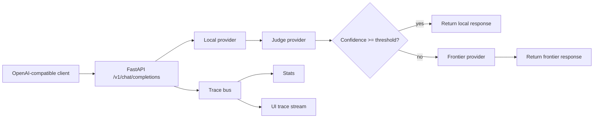

# Architecture

CoreThread is a FastAPI service with an OpenAI-compatible chat surface.

## Core Modules

- `corethread/main.py`: FastAPI app, lifespan startup, providers, routes, error envelopes.
- `corethread/config.py`: YAML parsing, profile normalization, environment-key resolution.
- `corethread/orchestrator.py`: local -> judge -> optional frontier decision flow.
- `corethread/providers/`: Ollama, LM Studio, and OpenAI-compatible adapters.
- `corethread/streaming.py`: OpenAI-style chat-completion chunk framing helpers.
- `corethread/api_ui.py`: UI-facing config, trace, stats, and transcript endpoints.
- `frontend/`: Vite/React UI for traces, stats, and config.

## Routing Flow

1. Client sends an OpenAI-shaped chat-completion request.
2. CoreThread sends it to the configured local profile.
3. The judge profile evaluates the local answer.
4. If the score passes, CoreThread returns the local response.
5. If the score fails, CoreThread prepends the configured constraint prompt and
   sends the request to the frontier profile.
6. CoreThread emits a body-free trace either way.

## Compatibility Boundary

CoreThread aims to behave like an OpenAI `/v1/chat/completions` endpoint for raw
HTTP/SSE clients and the official OpenAI Python SDK. It does not currently try to
implement the whole OpenAI API.
